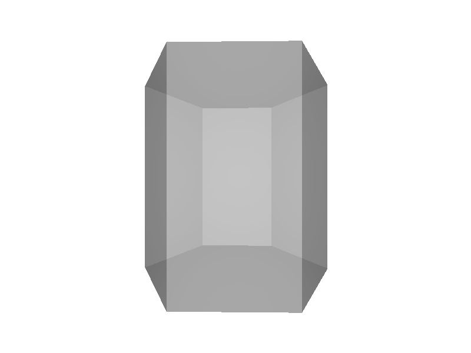
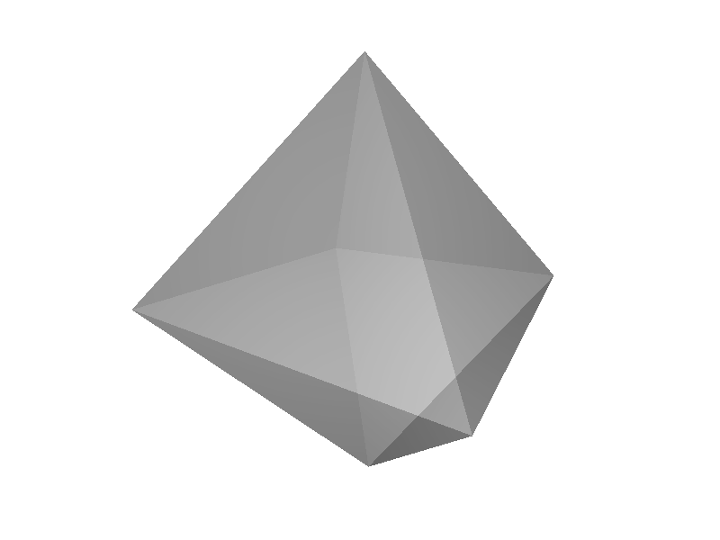
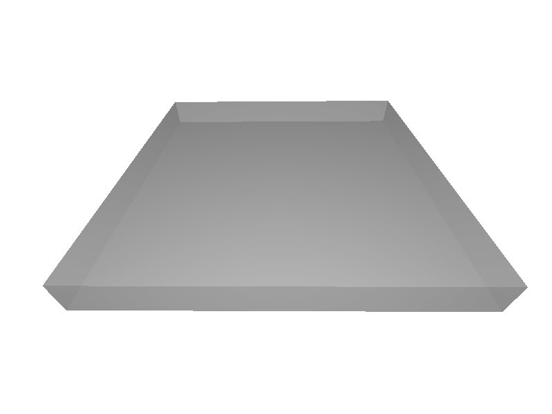
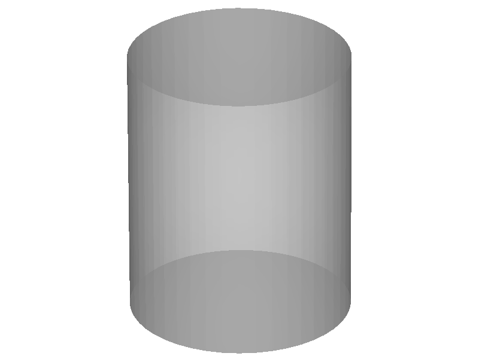
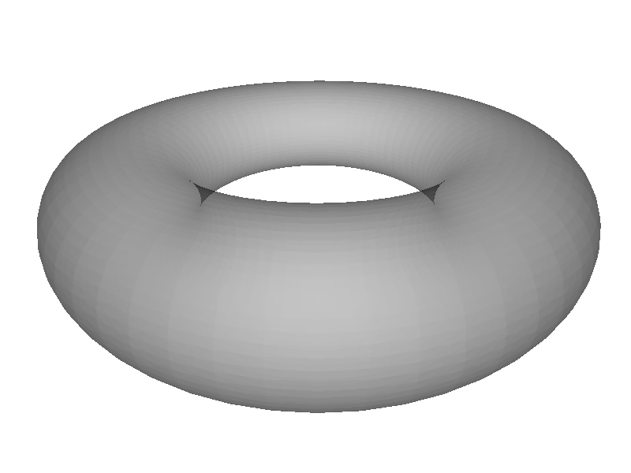

Building a Geometry
===================

.. module:: chroma.geometry

The Mesh Class
--------------

.. autoclass:: Mesh
   :members:

The Solid Class
---------------

.. autoclass:: Solid
   :members:

The Material Class
------------------

.. autoclass:: Material
   :members:

The Geometry Class
------------------

.. autoclass:: Geometry
   :members:

Importing from STL
------------------

.. autofunction:: chroma.mesh_from_stl

Mesh Modelling Tools
--------------------

.. module:: chroma.make

.. autofunction:: linear_extrude

.. autofunction:: rotate_extrude

.. autofunction:: box

.. autofunction:: cube

.. image:: images/cube.png
   :height: 100px

.. autofunction:: cylinder

.. autofunction:: segmented_cylinder

.. autofunction:: sphere

.. image:: images/sphere.png
   :height: 100px

.. autofunction:: torus

