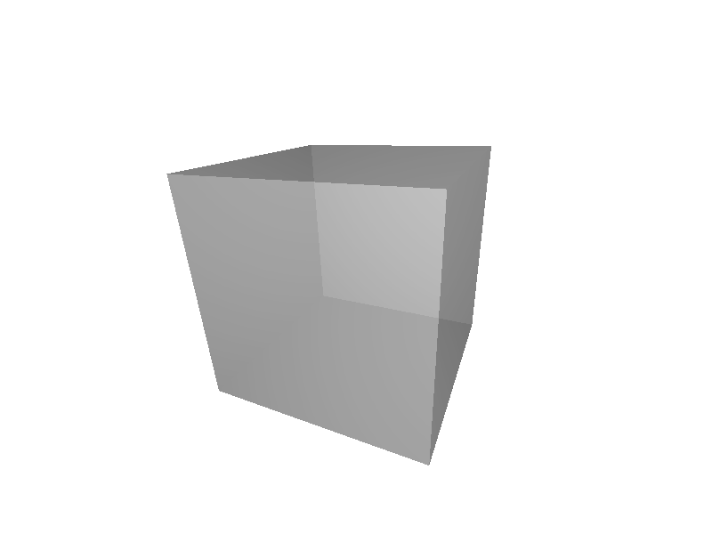

Rendering Tools
===============

.. module:: chroma

There are three different ways to render a geometry: you can explicitly create a :class:`Camera` instance, call the function :func:`view`, or use the script `chroma-cam`.

Example:
        >>> chroma.view(chroma.make.cube())

To control the camera refer to the following table and :ref:`camera_hotkeys`.

.. _camera_controls:

============== =========== ===========================
Thing You Do   Modifier    Thing That Happens
============== =========== ===========================
click and drag             rotate camera around object
click and drag shift       translate camera
click and drag control     rotate camera
mouse wheel                zoom
============== =========== ===========================

.. _camera_hotkeys:

Camera Hotkeys
--------------

========= ===============================
Command   Thing That Happens
========= ===============================
alt       toggle fine motion
F11       toggle fullscreen
escape    quit
=         increase the alpha depth by one
\-        decrease the alpha depth by one
pagedown  move down through the bounding volume hierarchy tree
pageup    move up through the bounding volume hierarchy tree
3         toggle 3d mode
g         toggle 3d colors between red/cyan and green/magenta
F12       take a screenshot
m         make a movie
F5 [#f1]_ toggle hybrid monte carlo rendering mode
F6 [#f2]_ place a light source at the camera's current location
F7 [#f2]_ add another light source at the camera's current location
========= ===============================

.. rubric:: Footnotes

.. [#f1] The hybrid monte carlo rendering mode requires the geometry have surfaces with a non-zero diffuse reflection probability.

.. [#f2] Only available in hybrid monte carlo rendering mode.

The Camera Class
----------------

.. class:: Camera(geometry, size=(800,600), device_id=None)

   The :class:`Camera` class uses :mod:`pygame` to render a geometry.
   :class:`Camera` objects inherit from :class:`multiprocessing.Process` so
   that you can render multiple geometries in separate windows at the same
   time. 

   .. method:: start()

      Create a :mod:`pygame` window, intialize CUDA, and start the camera.
